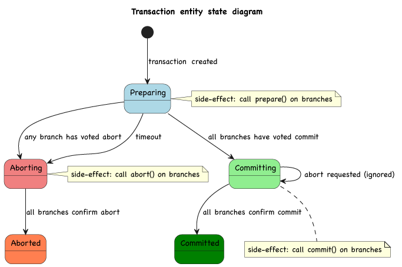

# Two-phase commit protocol
The three tenants of the 2PC protocol are *prepare*, *commit*, and *abort*: in `endless-transaction`, participating branches define effectful expressions for the three operations.

## Prepare
Validate a *query* value, possibly effect the local branch context, and return a *vote* value. The vote is a signal for the coordinator to either *commit* or *abort* the transaction. This expression can involve any kind of asynchronous process, and there is no limit to the time it takes for the vote to be delivered to the coordinator (unless a timeout is configured).
Below are some examples of prepare operations in an imaginary (and somewhat convoluted) touristic journey booking process:

| Example: orchestration of the booking process for a journey                          | Data store         | Transaction branch operation                                           |
|--------------------------------------------------------------------------------------|--------------------|------------------------------------------------------------------------|
| Create cancelable hotel & flight reservations                                        | External API       | Make a reversible synchronous HTTP POST/PUT request                    |
| Request the billing back-end for credit card guarantee charge and await confirmation | Internal service   | Send a message or call an endpoint and wait for an event to occur      |
| Add details to the customer row in the database                                      | Database           | Acquire an exclusive lock on a database row or use built-in XA support |
| Grab a semaphore to update the "recent bookings" cache                               | In-memory resource | Lock an in-memory resource                                             |
| Schedule traveller reminder notifications                                            | Actor cluster      | Send a command to an actor                                             |
| Add an entry in a bookings log                                                       | File               | Persist a rollback-ready change in a file                              |

## Commit
This is triggered by the coordinator after all branches have voted for commit. The branch is expected to effect the local context to make at least part of the change durable and return a *confirmation* value.

Like for *prepare* above, this expression can involve any kind of asynchronous process, and the toolkit does not impose a limit on the time it takes for the confirmation to be delivered to the coordinator.

Some examples of commit operations in the same imaginary touristic journey booking process:

| Example: orchestration of the booking process for a journey   | Data store         | Transaction branch operation          |
|---------------------------------------------------------------|--------------------|---------------------------------------|
| Do nothing: reservations were already made                    | External API       | -                                     |
| Do nothing: the guarantee charge was already made             | Internal service   | -                                     |
| Update customer details in the internal database              | Database           | Perform the row update and unlock     |
| Update the "recent bookings" cache and release the semaphore  | In-memory resource | Edit and unlock an in-memory resource |
| Do nothing: the reminder notifications were already scheduled | Actor cluster      | -                                     |
| Do nothing: the bookings log was already updated              | File               | -                                     |

@@@ note { title="Commit consistency" }
It's up to the implementer to decide the level of consistency in the execution of the commit. Transaction failure is also valid and can be signaled by raising an exception in the target effect. Failure will lead to inconsistency in the overall system state, which can be an acceptable
compromise in some use cases.

For instance, in our imaginary example, the "in-memory cache" could be locked only briefly to preserve throughput. Because it's optional to the journey process, updating it could be skipped in case of delays. On the other hand, if the "internal database" update still fails despite the lock, the commit expression could signal this by raising an exception. The exception would conclude the transaction in a failed state, allowing surfacing in the UI for manual remediation.
@@@

## Abort

This is triggered by the coordinator after at least one branch has voted for abort. The branch is expected to effect the local context to roll back the changes and return a *confirmation* value. The same flexibility as for *prepare* and *commit* applies here.

Some examples of abort operations in the same imaginary process:

| Example: orchestration of the booking process for a journey                 | Data store         | Transaction branch operation                           |
|-----------------------------------------------------------------------------|--------------------|--------------------------------------------------------|
| Cancel the hotel & flight reservations                                      | External API       | Send a message or call and endpoint of another service |
| Cancel the credit guarantee charge                                          | Internal service   | Send a message to another service                      |
| Do nothing: the customer details do not need to be updated                  | Database           | Unlock the row and do nothing                          |
| Release the semaphore and do nothing: the cache does not need to be updated | In-memory resource | Unlock an in-memory resource                           |
| Cancel the reminder notifications                                           | Actor cluster      | Send a command to an actor                             |
| Roll back the booking log entry                                             | File               | Roll back the change in a file                         |

@@@ note { title="Abort consistency" }
The same flexibility applies here as for the commit operation: it's up to the implementer to decide the level of consistency in the execution of the abort. In this dummy example, let's suppose traveler reminders have already been sent: a compensation action could be to schedule a new notification inviting the customer to ignore previous messages. On the other hand, failing to cancel the hotel and flight reservations would be a more serious issue and should be considered a failed transaction to elicit manual remediation.
@@@

## State diagram

Protocol state throughout the phases mentioned above is tracked by an event-sourced entity, with events representing state transitions. The transaction state machine diagram is depicted below. As usual, side-effects are invoked after successful event persistence and repeated in case of recovery (at least once delivery characteristics).

@@@ warning { title="Consider the use case carefully" }
Certain use cases call for different techniques: for instance, the classical challenge of publishing events to a broker atomically with a change in a database is best solved by the simpler transaction outbox pattern or event sourcing.
@@@

@@@ note { title="2PC is often used in distributed technologies" }
- Distributed databases such as CockroachDB, MongoDB, and others implement 2PC to atomically store values across partitions.
- Apache Kafka allows producing messages across multiple partitions atomically with an implementation similar to 2PC.
@@@