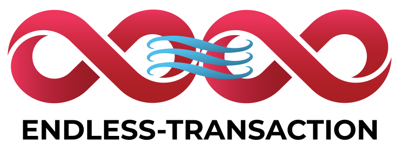

`endless-transaction` is a Scala library that provides a flexible functional abstraction to orchestrate distributed transactions based on cats-effect and the [endless](https://endless4s.github.io/) library. It is a simple tool to simplify the process of coordinating transactions using a [two-phase commit protocol](https://en.wikipedia.org/wiki/Two-phase_commit_protocol).

This is not "old-school" 2PC however: it can be used to describe any form of two-phase consensus which does not necessarily imply timing restrictions or some form of locking. This makes it possible to implement both short-lived and [long-running transactions](https://en.wikipedia.org/wiki/Long-running_transaction) (also known as sagas, typically making use of [compensating transactions](https://en.wikipedia.org/wiki/Compensating_transaction)). The library simply offers easy access to a persistent, sharded entity to track two-phase protocol state in a reactive fashion.

@@@ index
* [Getting Started](getting-started.md)
* [In a nutshell](nutshell.md)
* [Abstractions](abstractions.md)
* [Example app](example.md)
* [Reference](reference.md)
@@@
